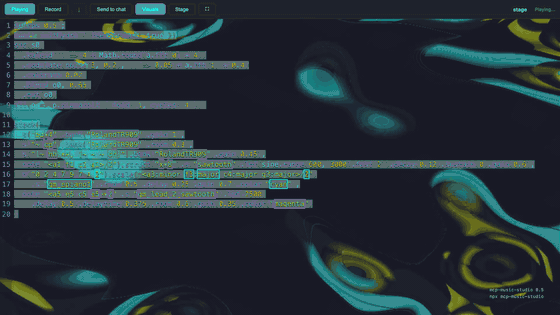

# MCP Music Studio

Two-mode creative music studio for AI: **scored composition** (ABC notation with sheet music) and **live performance** (Strudel live coding with TidalCycles). Interactive UI renders inline in Claude Desktop, claude.ai, and other MCP clients.

<a href="https://github.com/linxule/mcp-music-studio/releases/download/v0.5.3/mcp-music-studio-v0.5-live-set-1080p60.mp4"></a>

*One continuous live set through the widget — every section a hot-swapped re-evaluation on the same clock. Full video: [16:9 1080p60](https://github.com/linxule/mcp-music-studio/releases/download/v0.5.3/mcp-music-studio-v0.5-live-set-1080p60.mp4) · [3:4 for phones](https://github.com/linxule/mcp-music-studio/releases/download/v0.5.3/mcp-music-studio-v0.5-live-set-3x4-1080x1440.mp4). Made with `dev/perform.html` and an OBS Browser Source (see `scripts/showcase/`).*

## Quick Start — No Install Required

Paste this URL into any MCP client that supports remote servers:

```
https://mcp-music-studio.linxule.workers.dev/mcp
```

**Claude Desktop / claude.ai:**
Settings → Connectors → Add Connector → paste the URL above → done.

**Claude Code:**
```bash
claude mcp add --transport http music-studio https://mcp-music-studio.linxule.workers.dev/mcp
```

That's it — ask Claude to play a song or create a beat.

---

## What You Get

### Scored Composition (ABC Notation)
Write sheet music → see it rendered → hear it played with multi-instrument audio.

- **8 style presets** — rock, jazz, bossa, waltz, march, reggae, folk, classical — one parameter adds drums + bass + chord accompaniment
- **All 128 General MIDI instruments** — named and fuzzy-matched (`"sax"` → Soprano Sax); the result text says what it actually resolved to when that isn't what you asked for. When the score picks its own instrument (`%%MIDI program`), the Instrument menu shows it, and choosing another really swaps the melody's instrument
- **Visual sheet music** — notes highlight as they play (on the swung beat when `swing` is set), and the score scrolls to keep the playing line in view. Scroll by hand at any time and the follow steps aside
- **Streaming render** — sheet music appears as the AI types
- **Edit in place** — open the ABC source pane in the widget, fix a bar, re-render without another tool call
- **Real transposition** — `transpose` rewrites the notation *and* the key signature, so the printed score matches what plays
- **Swing and count-in** — `swing` is the share of the beat given to its first half (50 = straight, 66 = triplet, 75 = max; ≤50 is no swing), `drumIntro` adds up to 8 bars of count-in from the style's drum kit
- **Selectable sound banks** — FluidR3 (default), MusyngKite (fuller), or a lightweight dry bank, switched live from the toolbar. Changing instrument, sound, style or tempo keeps your Loop and tempo settings and never starts a paused tune
- **Notes that ring out** — each note fades naturally instead of stopping dead, and a light **Room** echo (on by default, one toolbar toggle) gives the synth a space to play in. WAV downloads and share links sound the same
- **WAV download** — export audio as WAV files directly from the UI
- **MIDI download** — export a standard MIDI file straight from the score, no playback needed first. It is the *score*: abcjs applies swing during playback only, so the exported file has none
- **`get-music-guide`** — 7 reference topics (instruments, drums, ABC syntax, arrangements, genres, styles, MIDI directives)

### Live Performance (Strudel)
Write code → hear it play → edit in a live REPL.

- **TidalCycles mini-notation** in JavaScript
- **71 drum machine banks** + **128 GM instruments** + 128 VCSL orchestral/world/percussion samples + built-in synths
- **Full effects chain** — filters, reverb, delay, FM synthesis
- **Editable REPL** — users can tweak the code and hear changes instantly
- **Live visuals** — add `.pianoroll()` / `.punchcard()` / `.scope()` / `.spectrum()` / `.spiral()` / `.pitchwheel()` to animate behind the code (native strudel.cc overlay)
- **Layered and hand-drawn visuals** — give each visual its own canvas with `ctx: getDrawContext('name')` so several play at once, or draw anything yourself with `.onPaint((ctx, time, haps) => …)`, reacting to the notes and the sound
- **Inline visuals and sliders** — `._pianoroll()`, `._scope()` and friends draw under their own line of code; `slider(value, min, max)` puts a knob in the code to drag while it plays
- **Hydra shader backgrounds** — `await initHydra()` + Hydra code for fully custom, music-synced WebGL visuals. `H(pattern)` locks a shader parameter to the sequence — notes arrive as MIDI numbers, so a melody can steer a shader — and `feedStrudel` post-processes the piano roll
- **Audio-reactive shaders** — `a.fft[0]`, `a0()`, `a.setBins(6)` and the rest of Hydra's audio API work verbatim, driven by **Strudel's own output** rather than the microphone (no permission prompt, no room noise)
- **`visuals` preset** — one enum value (`pianoroll`, `punchcard`, `scope`, `spectrum`, `hydra-kaleid`, `hydra-pulse`, `hydra-wash`, `hydra-feed`) gives a bare pattern something to paint. Never overrides code that already visualises itself
- **`theme`** — 39 CodeMirror colour schemes; the visuals stage and its readability scrim are derived from the active theme, so light themes stay readable
- **Stage mode** — hide the code and let the visuals fill the frame (composes with the host's fullscreen)
- **Honest runtime feedback** — evaluation errors, unknown sound names, and stops the user triggered are reported back to the model as they happen, so it never answers about a silent widget as if the music were still playing
- **Server-side validation** — the local server evaluates every Strudel pattern headlessly before answering: the tool result reports layers, events per cycle, tempo, and which sound names are registered (or a syntax error with line:column), so terminal clients get real diagnostics too. (The hosted worker can't — Cloudflare forbids dynamic code generation — and says so.)
- **Record & download** — capture live audio and export as WAV (recordings longer than about two minutes download in the recorder's own compressed format, so the file stays a sensible size)
- **`get-strudel-guide`** — 9 reference topics (mini-notation, sounds, effects, patterns, genres, tips, visuals, hydra, advanced)

### Shared
- **`analyze-harmony`** — chord detection, key detection, progressions, chord scales; answers in both ABC chord symbols and Strudel `chord()`/`note()` form
- **`convert-abc-to-strudel`** — take a scored melody into the live REPL: bars become mini-notation groups, durations become `@` weights, chord symbols become a `chord().voicing()` line
- **`search-music-docs`** — semantic search over strudel.cc and ABCJS documentation
- **Click-to-play links** — in clients that can't render the inline widget (terminals, CLIs), both play tools return a hosted URL that actually plays. Short pieces travel in the link itself; longer ones are stored for 30 days
- **Widgets that fit the host** — both widgets size themselves from the host's container (inline, fixed or fullscreen), respect safe-area insets and the host's fonts, and never pan sideways on a phone. If the browser holds audio back until a tap, the widget says "Tap Play to start audio" instead of pretending to play. Scrolling past a widget never starts it, and a tune autoplays once — not again every time the host rebuilds the widget

---

## Local Install (Optional)

The remote URL above works without any local setup. If you prefer running locally (offline use, lower latency), install via npm:

### CLI One-Liners

```bash
# Claude Code
claude mcp add music-studio -- npx -y mcp-music-studio --stdio

# Codex CLI
codex mcp add -- npx -y mcp-music-studio --stdio

# Gemini CLI
gemini mcp add -- npx -y mcp-music-studio --stdio

# OpenCode
opencode mcp add music-studio -- npx -y mcp-music-studio --stdio
```

### JSON Config (Claude Desktop, Cursor, Windsurf, etc.)

<details>
<summary>Claude Desktop — edit config file</summary>

| OS | Path |
|----|------|
| macOS | `~/Library/Application Support/Claude/claude_desktop_config.json` |
| Windows | `%APPDATA%\Claude\claude_desktop_config.json` |
| Linux | `~/.config/Claude/claude_desktop_config.json` |

```json
{
  "mcpServers": {
    "music-studio": {
      "command": "npx",
      "args": ["-y", "mcp-music-studio", "--stdio"]
    }
  }
}
```
</details>

<details>
<summary>VS Code / Trae / PearAI</summary>

Add to `.vscode/mcp.json` — note: uses `"servers"` not `"mcpServers"`:

```json
{
  "servers": {
    "music-studio": {
      "command": "npx",
      "args": ["-y", "mcp-music-studio", "--stdio"]
    }
  }
}
```
</details>

<details>
<summary>Cursor</summary>

Add to `~/.cursor/mcp.json`:

```json
{
  "mcpServers": {
    "music-studio": {
      "command": "npx",
      "args": ["-y", "mcp-music-studio", "--stdio"]
    }
  }
}
```
</details>

<details>
<summary>Windsurf</summary>

Add to `~/.codeium/windsurf/mcp_config.json`:

```json
{
  "mcpServers": {
    "music-studio": {
      "command": "npx",
      "args": ["-y", "mcp-music-studio", "--stdio"]
    }
  }
}
```
</details>

<details>
<summary>Windows</summary>

On Windows, `npx` is a `.cmd` file and requires a shell wrapper:

```json
{
  "mcpServers": {
    "music-studio": {
      "command": "cmd",
      "args": ["/c", "npx", "-y", "mcp-music-studio", "--stdio"]
    }
  }
}
```
</details>

<details>
<summary>Render modes (for non-ext-apps clients)</summary>

Clients that support ext-apps render the interactive UI inline automatically (`auto` mode). For clients that don't (Cherry Studio, CLI environments), use `--render-mode`:

| Mode | Behavior |
|------|----------|
| `auto` (default) | Inline UI for Claude Desktop, VS Code |
| `browser` | Saves HTML and opens in system browser |
| `html` | Returns HTML as embedded resource |

```json
{
  "mcpServers": {
    "music-studio": {
      "command": "npx",
      "args": ["-y", "mcp-music-studio", "--stdio", "--render-mode", "browser"]
    }
  }
}
```

Clients without a widget also get a **click-to-play link** in the tool result, served by the hosted worker — no local render mode needed.
</details>

<details>
<summary>HTTP mode (<code>--host</code>, <code>--allow-origin</code>)</summary>

Without `--stdio` the server listens over Streamable HTTP. That endpoint is **unauthenticated**, so it binds `127.0.0.1:3001` by default and only accepts browser requests from loopback origins.

| Flag | Default | Purpose |
|------|---------|---------|
| `--host ADDR` | `127.0.0.1` | Bind address. A non-loopback value prints a warning and turns off the SDK's DNS-rebinding protection — put a proxy that authenticates in front of it |
| `--allow-origin ORIGIN` | loopback pages only | Extra CORS origins (comma-separated, repeatable; `*` opts back into a wildcard) |
| `PORT` (env) | `3001` | Listen port |

</details>

---

## Tools

| Tool | Description | Parameters |
|------|-------------|------------|
| `play-sheet-music` | ABC notation → visual sheet music + multi-instrument audio | `abcNotation`, `title?`, `instrument?`, `style?`, `tempo?` (40–240), `swing?` (0–75), `drumIntro?` (0–8), `transpose?` (−12–12) |
| `play-live-pattern` | Strudel code → live-coded patterns with synthesis + effects | `code`, `title?`, `bpm?` (40–300), `autoplay?`, `visuals?`, `theme?` |
| `get-music-guide` | ABC reference (7 topics: instruments, drums, syntax, genres...) | `topic` |
| `get-strudel-guide` | Strudel reference (9 topics: sounds, effects, visuals, hydra, genres...) | `topic` |
| `search-music-docs` | Semantic search over strudel.cc and ABCJS docs | `query`, `library` (`strudel` \| `abcjs`) |
| `analyze-harmony` | Name a chord, guess the key, get a progression or chord scale — in ABC and Strudel spellings | `task`, `notes?`, `chords?`, `key?`, `romanNumerals?` |
| `convert-abc-to-strudel` | Turn a scored ABC melody into a Strudel mini-notation pattern | `abcNotation`, `voice?`, `sound?` |

**`visuals`** — `none`, `pianoroll`, `punchcard`, `scope`, `spectrum`, `hydra-kaleid`, `hydra-pulse`, `hydra-wash`, `hydra-feed`.
**`theme`** — any of the 39 schemes the Strudel REPL ships (`strudelTheme`, `nord`, `sonicPink`, `teletext`, `gruvboxDark`, `githubLight`, …).
**`style`** — `rock`, `jazz`, `bossa`, `waltz`, `march`, `reggae`, `folk`, `classical`.

## Prompts

Slash-command / menu entry points, in clients that surface MCP prompts:

| Prompt | What it does |
|--------|--------------|
| `compose-beat` | Generate + play a Strudel pattern in a genre (args: `genre`, `mood?`) |
| `harmonize-melody` | Add chords/accompaniment to an ABC melody and play it (args: `melody`, `style?`) |
| `arrange-tune` | Turn a melody/idea into a multi-voice arrangement (args: `tune`, `instrumentation?`) |

## 0.5.13 — September 25, 2026

The sheet widget's **Room** button showed as a blank blue box while on: its
label was drawn in the same blue as its pressed background (0.5.10–0.5.12).
It now reads like the Edit toggle, white on blue.
[0.5.13](https://github.com/linxule/mcp-music-studio/releases/tag/v0.5.13)

## 0.5.12 — September 25, 2026

Tested on a phone, then opened up. Scrolling a conversation no longer starts
music, and a tune autoplays once per tool call instead of on every rebuild;
Strudel code wraps. Sheet music rings out — a softer note release and a light
Room echo, in the widget, WAV downloads and share links. Strudel visuals gain
layers, hand-drawn `onPaint` art, inline visuals and sliders, and pitch-driven
Hydra shaders, and share links now match the widget. Details:
[0.5.9](https://github.com/linxule/mcp-music-studio/releases/tag/v0.5.9) ·
[0.5.10](https://github.com/linxule/mcp-music-studio/releases/tag/v0.5.10) ·
[0.5.11](https://github.com/linxule/mcp-music-studio/releases/tag/v0.5.11) ·
[0.5.12](https://github.com/linxule/mcp-music-studio/releases/tag/v0.5.12).

## 0.5.6 — September 14, 2026

Dependency and compatibility maintenance: audited dependency locks, ext-apps v2
widgets, the SDK v1-compatible worker adapter, and validated worker startup.
The seven tools, music features and UI controls retain their existing behavior.
Builds now synchronize the MCP Registry metadata with the package version, and
publishing waits for the npm package to propagate before registry registration.

## Development

Use Bun 1.4.2 and Node 24 for development and CI. Dependency updates use the Bun
ecosystem so both package manifests and lockfiles stay consistent. The server
retains SDK v1 and the worker uses Agents' legacy MCP handler; widgets use
ext-apps v2. CI checks both locks for vulnerabilities and exercises the real
worker HTTP transport as well as the local/worker parity suite. The worker entry
module exports only its fetch handler; test helpers stay in the implementation
module because workerd rejects constants as runtime entry points.

```bash
bun install
bun run dev      # watch + serve (hot reload)
bun run build    # production build (widgets must be built before the tests)
bun run test     # run tests
```

`dev/` is a local ext-apps host harness for driving the widgets outside a real client — see [`dev/README.md`](dev/README.md).

## Attribution

Forked from the [Sheet Music Server](https://github.com/modelcontextprotocol/ext-apps/tree/main/examples/sheet-music-server) example from [MCP ext-apps](https://github.com/modelcontextprotocol/ext-apps) by Anthropic, licensed under MIT.

Live coding is powered by [Strudel](https://strudel.cc) — canonical repo at [codeberg.org/uzu/strudel](https://codeberg.org/uzu/strudel) (the project moved off GitHub, so the GitHub mirror can be stale). Notation and playback use [abcjs](https://github.com/paulrosen/abcjs); shader backgrounds use [hydra-synth](https://hydra.ojack.xyz).

## License

MIT
